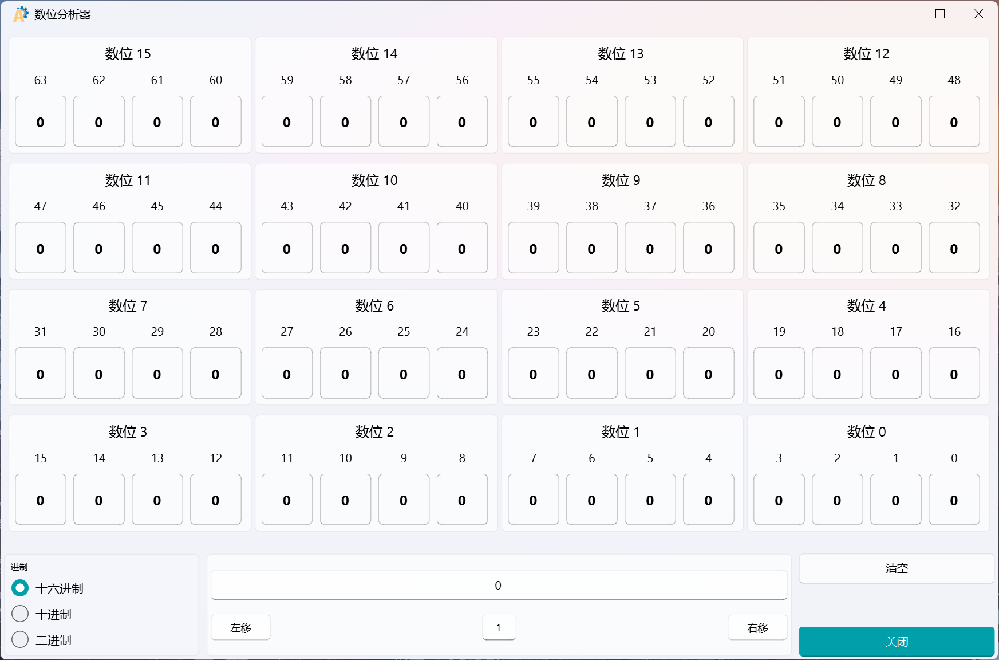
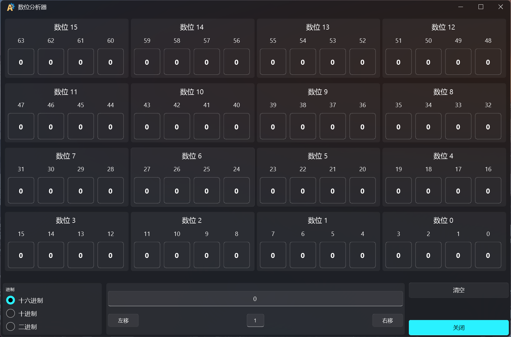

# 数位分析器 (Register Analysis)

一个基于 PyQt5 和 qfluentwidgets 开发的现代化数位分析工具，用于可视化显示和编辑二进制、十六进制和十进制数值。

## 功能特点

- 🎨 **现代化 UI 设计**：采用 Fluent Design 风格，支持 Mica 效果
- 🌓 **主题切换**：支持自动跟随系统主题（深色/浅色）
- 📊 **可视化数位显示**：直观展示 64 位数值的每个比特位状态
- 🔢 **多进制支持**：支持二进制、十六进制和十进制输入
- ⚡ **交互式操作**：点击比特位可直接切换状态
- ↔️ **移位操作**：支持左移和右移操作
- 🎯 **实时计算**：输入数值后自动更新比特位显示
- 💫 **透明效果**：比特位显示框具有透明背景和圆角效果
- 📱 **自适应布局**：支持窗口大小调整，布局自动适应

## 技术栈

- **Python 3.8+**
- **PyQt5**：GUI 框架
- **PyQt5-Fluent-Widgets**：现代化 UI 组件库
- **Mica 效果**：Windows 11 专属透明效果

## 安装和运行

### 安装依赖

```bash
# 安装完整版（包含所有功能）
pip install "PyQt5-Fluent-Widgets[full]" -i https://pypi.org/simple/
```

### 运行应用

```bash
python app.py
```

### 编译软件

#### 使用Python编译脚本

1. 运行编译脚本
   ```bash
   python build.py
   ```

2. 脚本会自动：
   - 检查Python版本
   - 安装PyInstaller（如果需要）
   - 使用app.spec文件编译软件

3. 编译完成后，可执行文件将生成在 `dist` 目录下

#### 手动编译

```bash
# 安装 PyInstaller
pip install pyinstaller

# 使用app.spec文件编译
python -m pyinstaller app.spec

# 或直接指定编译选项
python -m pyinstaller \
    --name "RegisterAnalysisFluentVer" \
    --icon "TitleIco.ico" \
    --onefile \
    --windowed \
    --add-data "TitleIco.ico;." \
    app.py
```

编译选项说明：
- `--name`：指定生成的可执行文件名称（英文）
- `--icon`：指定应用程序图标
- `--onefile`：生成单个可执行文件
- `--windowed`：不显示控制台窗口
- `--add-data`：添加额外的数据文件

## 编译后文件

编译完成后，将在 `dist` 目录下生成以下文件：
- `数位分析器.exe`：主可执行文件
- `src/`：包含截图等资源文件

## 注意事项

1. 确保使用 Python 3.8 或更高版本
2. 编译过程中可能需要安装额外的依赖
3. 编译后的可执行文件可能会被杀毒软件误报，这是正常现象
4. 如需修改图标或资源文件，可编辑 `build.bat` 脚本
5. 如需生成安装包，可使用 Inno Setup 或其他安装包制作工具

## 使用说明

1. **输入数值**：在底部输入框中输入数值，支持二进制、十六进制和十进制
2. **切换进制**：点击左侧单选按钮切换输入进制
3. **点击比特位**：直接点击上方的比特位可切换其状态（0 ↔ 1）
4. **移位操作**：在移位输入框中输入移位量，点击左移或右移按钮
5. **清空比特位**：点击右下角的"清空"按钮
6. **关闭应用**：点击右下角的"关闭"按钮

## 截图展示

### 浅色主题



### 深色主题



## 项目结构

```
RegisterAnalysisFluentVer/
├── src/
│   └── img/
│       └── md/               # 文档截图
│           ├── DarkTheme.png  # 深色主题截图
│           └── LightTheme.png # 浅色主题截图
├── views/                    # 视图组件
│   ├── ClickableLineEdit.py  # 可点击的比特位输入框
│   ├── MainWindow.py         # 主窗口
│   └── __init__.py
├── app.py                    # 应用入口
├── config.py                 # 配置文件
├── requirements.txt          # 依赖列表
├── README.md                 # 项目说明
└── LICENSE                   # 许可证
```

## 许可证

本项目采用 Apache-2.0 许可证，详见 LICENSE 文件。

## 开发说明

- 本项目使用 PyQt5 和 qfluentwidgets 开发
- 支持 Windows 11 Mica 效果
- 主题切换功能支持自动跟随系统
- 界面设计采用 Fluent Design 风格

## 更新日志

### v1.0.0
- 初始版本发布
- 支持 64 位数值分析
- 支持多进制输入和显示
- 支持主题切换
- 支持 Mica 效果

## 贡献

欢迎提交 Issue 和 Pull Request 来改进项目！

## 联系方式

如有问题或建议，欢迎通过 GitHub Issues 反馈。
